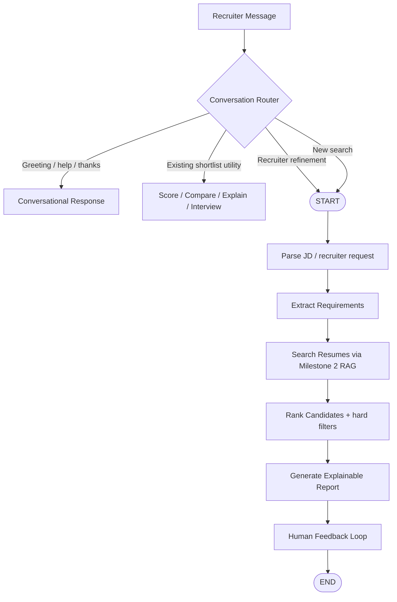

# Agentic Profile Matching — LangGraph State Machine

## Required core workflow

`START → Parse JD → Extract Requirements → Search Resumes → Rank Candidates → Generate Report → Human Feedback Loop → END`

The assignment's feedback loop is implemented across conversational turns: a recruiter refinement updates the active criteria and triggers the same LangGraph screening workflow again. Existing-shortlist commands do not rerun retrieval.

## Persistent conversation state

| Field | Purpose |
|---|---|
| `messages` | Recruiter/assistant conversation history. |
| `job_description` | Base job description for the current conversation. |
| `active_refinements` | Criteria added after the initial search. |
| `excluded_skills` | Skills explicitly excluded by the recruiter. |
| `requirements` | Structured must-have/nice-to-have requirements. |
| `candidate_shortlist` | Current ranked top-10 candidates. |
| `current_rankings` | Stable candidate IDs in current rank order. |
| `previous_rankings` | Stable candidate IDs from the prior refinement baseline. |
| `previous_scores` | Scores from the prior refinement baseline. |
| `current_scores` | Current candidate scores. |
| `ranking_changes` | Human-readable rank and score movement. |
| `screening_round` | 1 = screening, 2 = deep review, 3 = final recommendation. |
| `final_recommendations` | Round-3 hiring recommendations. |

## Accuracy rules

1. Follow-up commands such as highest/lowest score, ranking, comparison, explanation, and interview questions always use the current shortlist.
2. `Only show candidates who have X` is treated as a refinement when `X` is a recognized skill.
3. Refinements preserve the base job description and are appended to the active search criteria.
4. Candidate identity for rank-change tracking uses `candidate_id` / `resume_path`, not candidate name, so duplicate names cannot corrupt the comparison.
5. Must-have counts are computed from the same structured requirements used for filtering.
6. The agent requests a wide RAG pool and makes the final top-10 decision after hard filtering.
7. When the RAG score ties all hard-matching candidates, a small bounded experience tie-break is used only to make the ordering deterministic and informative.
8. Missing evidence is reported rather than invented.
